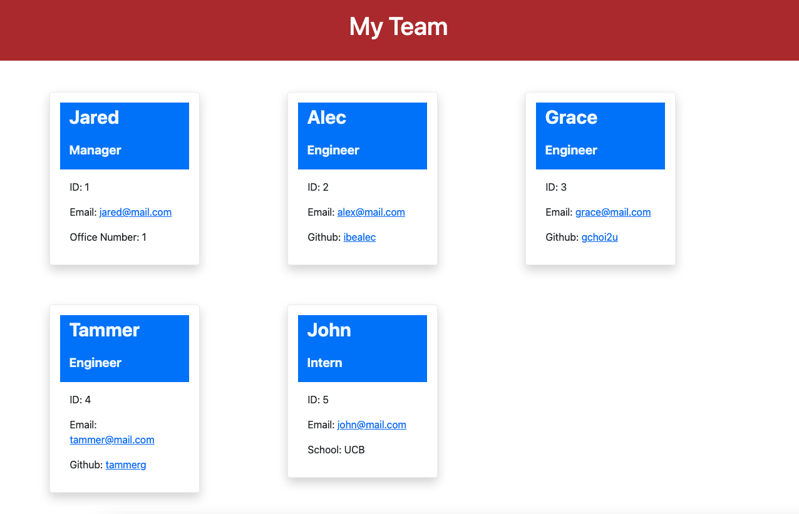

# **Team Profile Generator**

  ## Description

  This is a application that takes in information about employees on a software engineering team, then generates an HTML webpage that displays summaries for each person.

  ## Table of Contents
  * [Description](#description)
  * [Installation](#installation-instructions)
  * [Usage](#usage)
  * [License](#license)
  * [Contributions](#contributions-guidelines)
  * [Tests](#test-instructions)
  * [Questions](#questions)

  ## Installation Instructions
  npm i

  ## Usage
    First clone down the repo. Open on any code editor, then install the dependencies by running 'npm i' in the terminal. Next thing run 'npm start'. Follow the prompt in the terminal and answer all the question then you be all set. The HTML file will create inside dist folder.

  ## Contributions Guidelines
  none

  ## Test Instructions
  npm run test

  ## Questions
  If you have any questions: eycs0317@gmail.com

  [My GitHub](https://github.com/eycs0317)

  ## Sample Image

  
